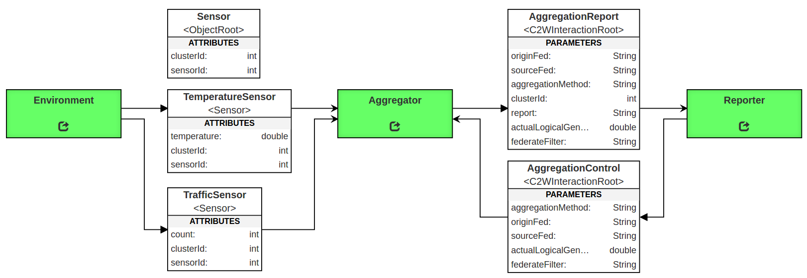

# UCEF Gateway Example: Sensor Aggregator

Assume we have a wireless sensor network with two types of sensors: one sensor that produces integer values, and one sensor that produces floating point values. These sensors are grouped into clusters, and each cluster reports one aggregate value from its membership to the base station to reduce network traffic. Each group has homogenous membership such that no cluster mixes integer and floating point sensors.

Let each sensor be represented by an HLA object. This object has attributes for the unique sensor ID, the name of its cluster, and the value (either int or float) of its measurement. Let each aggregate value be represented by an HLA interaction that has parameters for the cluster name and aggregate value. This produces the following federation diagram:
 

This federation has 3 federates which would each be a unique implementation of the UCEF gateway injection federate.

## Environment Federate

The environment federate has a configuration file with four properties:

1.	minimumClusterSize – the minimum number of sensors in a cluster
2.	maximumCluserSize – the maximum number of sensors in a cluster
3.	numberOfIntegerClusters – the number of clusters that produce integer values
4.	numberOfFloatClusters – the number of clusters that produce floating point values

It uses these settings to register and populate the sensor objects. During runtime, each integer sensor reports a random value 1 – 10 and each floating point sensor reports a random value 1.00 – 10.00.

## Aggregator Federate

The aggregator federate generates 1 report per cluster per logical time step based on the sensor object reflections that it receives during that time step. It has an additional control interaction that specifies the aggregation method (sum, average, median, minimum, maximum, …) that can be used later once we have CoA support.

## BaseStation Federate

The base station just outputs the results. It does not have much purpose in this example, but might later be useful to incorporate Cucumber.

## Features Tested

This federation was designed to cover the following features of UCEF Gateway:

1.	Sending and receiving interactions
2.	Sending and receiving object reflections
3.	Creating and reusing persistent object instances
4.	Performing some function at the very end of a logical time step
5.	Converting received values into the correct data types (integer and float)
6.	Working with full interaction/object class paths
7.	Using a custom JSON configuration file
